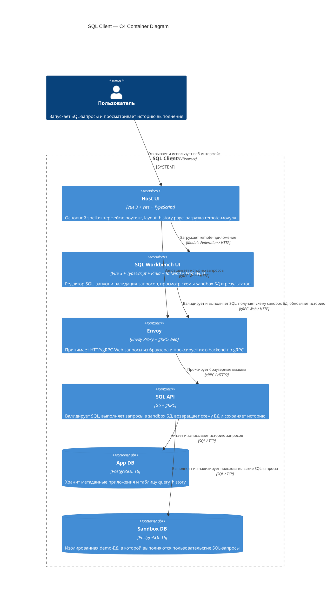

# C4 Container — SQL Client

Container-level схема системы `SQL Client`

## Контейнеры

- **Host UI** — контейнер-оболочка, который поднимает основной интерфейс и подключает remote `sql-workbench` через Module Federation
- **SQL Workbench UI** — основной рабочий экран для SQL editor, schema explorer, результатов выполнения и части сценариев работы с историей
- **Envoy** — слой совместимости для браузера, конвертирующий `gRPC-Web` в обычный `gRPC` backend-сервиса
- **SQL API** — backend на Go, который реализует методы `ValidateQuery`, `ExecuteQuery`, `GetSandboxSchema` и `ListQueryHistory`
- **App DB** — отдельная PostgreSQL БД для истории и служебных данных приложения
- **Sandbox DB** — отдельная PostgreSQL БД с demo-данными, куда направляются пользовательские SQL-запросы

## Основной сценарий взаимодействия

1. Пользователь открывает `Host UI`
2. `Host UI` загружает remote `SQL Workbench UI`
3. UI вызывает backend через `Envoy` по `gRPC-Web`
4. `SQL API` валидирует и исполняет SQL только в `Sandbox DB`
5. Результаты и метаданные выполнения возвращаются в UI
6. История выполнения сохраняется в `App DB`
