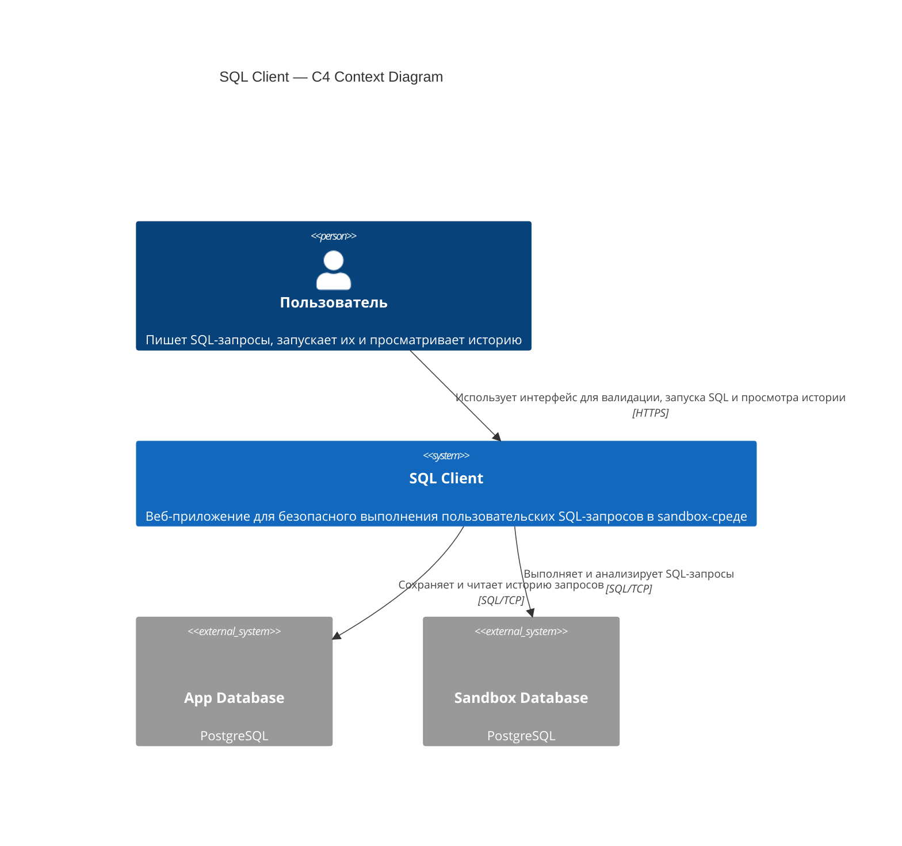

# C4 Context — SQL Client

Context-level схема системы `SQL Client`

## Особенности

- `Пользователь` работает с системой через веб-интерфейс
- `SQL Client` предоставляет сценарии валидации SQL, выполнения запросов, просмотра схемы БД и истории
- `App Database` используется для хранения истории выполнения запросов
- `Sandbox Database` используется как изолированная БД, в которой выполняются пользовательские запросы
