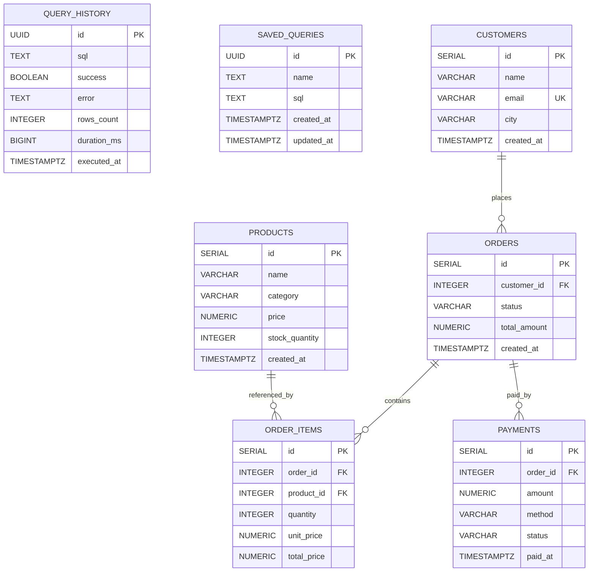

# ERD — SQL Client Databases

ERD для двух баз данных проекта `SQL Client`: `app DB` и `sandbox DB`

## Общая диаграмма

## App DB

Используется для метаданных приложения

### Таблицы

#### `query_history`
- `id` — PK, `UUID`
- `sql` — текст выполненного запроса
- `success` — флаг успешного выполнения
- `error` — текст ошибки
- `rows_count` — количество строк в результате
- `duration_ms` — длительность выполнения
- `executed_at` — время выполнения

Дополнительно:
- индекс `idx_query_history_executed_at` по `executed_at DESC`

#### `saved_queries`
- `id` — PK, `UUID`
- `name` — имя сохранённого запроса
- `sql` — текст запроса
- `created_at` — дата создания
- `updated_at` — дата обновления

Связей между таблицами `app DB` нет

## Sandbox DB

Используется для пользовательских SQL-запросов и demo-данных

### Связи

- `customers 1:N orders`
- `orders 1:N order_items`
- `products 1:N order_items`
- `orders 1:N payments`

### Таблицы

#### `customers`
- `id` — PK
- `name`
- `email` — уникальное поле
- `city`
- `created_at`

#### `products`
- `id` — PK
- `name`
- `category`
- `price`
- `stock_quantity`
- `created_at`

#### `orders`
- `id` — PK
- `customer_id` — FK → `customers.id`
- `status`
- `total_amount`
- `created_at`

#### `order_items`
- `id` — PK
- `order_id` — FK → `orders.id`
- `product_id` — FK → `products.id`
- `quantity`
- `unit_price`
- `total_price`

#### `payments`
- `id` — PK
- `order_id` — FK → `orders.id`
- `amount`
- `method`
- `status`
- `paid_at`

## Особенности

`App DB` и `Sandbox DB` логически и физически разделены. Прямых FK-связей между этими БД нет
