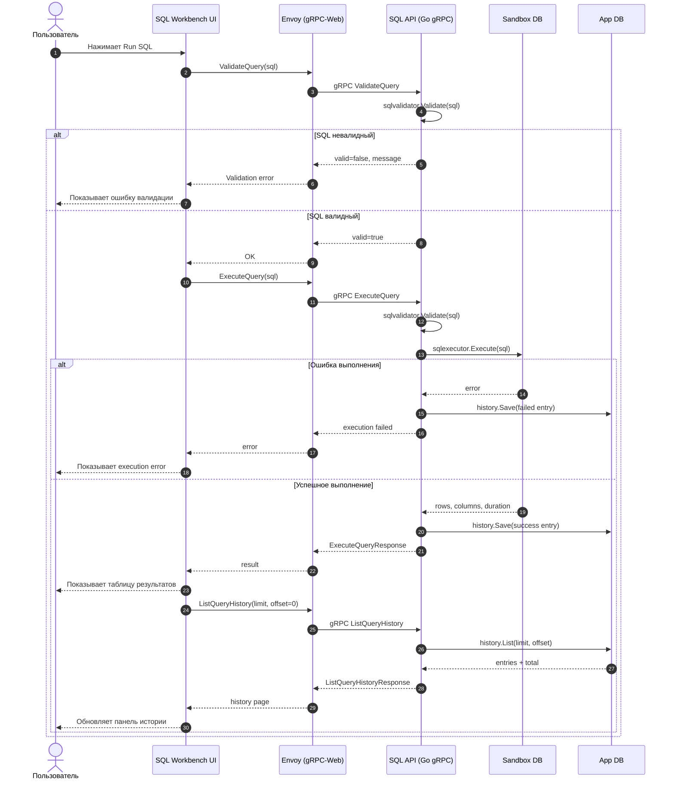
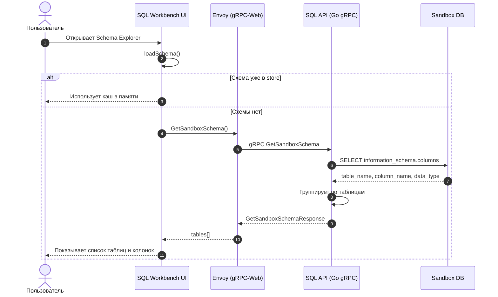
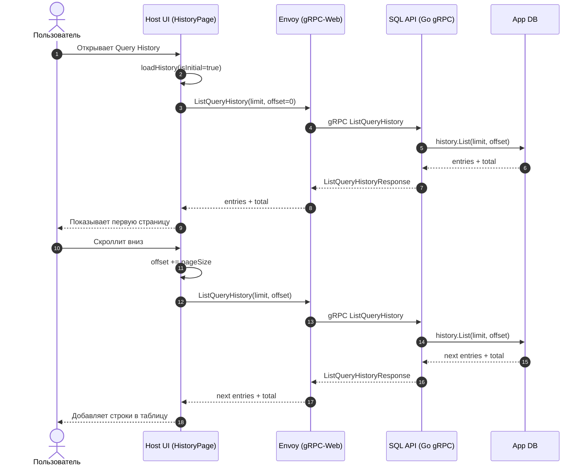

# Sequence Diagrams — SQL Client

Набор sequence-диаграмм для ключевых пользовательских сценариев в `SQL Client`

## 1) Выполнение SQL-запроса (Validate + Execute + Save History)

## 2) Загрузка схемы sandbox БД

## 3) Просмотр истории запросов (Host History page)

## Примечание

Во всех browser-сценариях клиент общается с backend через `Envoy` по `gRPC-Web`; сам backend работает по `gRPC` и обращается к `App DB`/`Sandbox DB` напрямую
